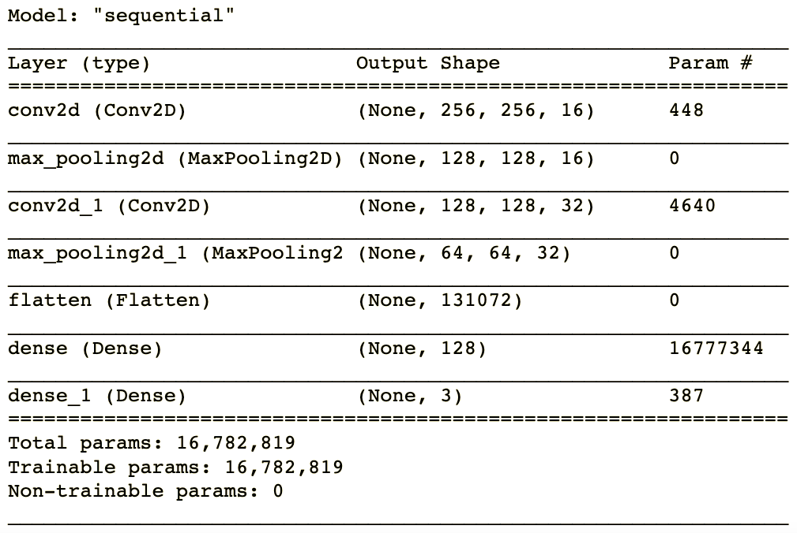
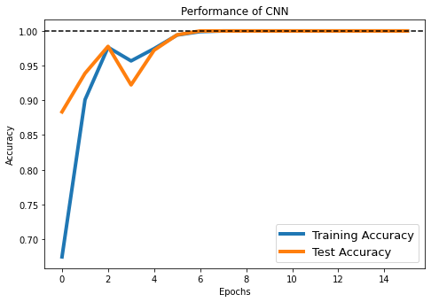

# Insect Image Classification

## Introduction

This project is to understand the Python implementation of Convolutional Neural Network (CNN) through the insect classification example. In this project, I applied CNN via `tensorflow` library in Python to classify insect images from beetle, cockroache and dragonflie categories.

## Data

The dataset is stored in the [insects folder](./insects). The original dataset is from [this website](https://www.insectimages.org/index.cfm). In this project, we only used a small fraction of them which contains beetle, cockroache and dragonflie images.

## CNN Model

The whole model is constructed through `tensorflow` library. And the basic structure of the CNN classifier is:

## Result

The final training and testing accuracy can be visualized with the number of epoches.

